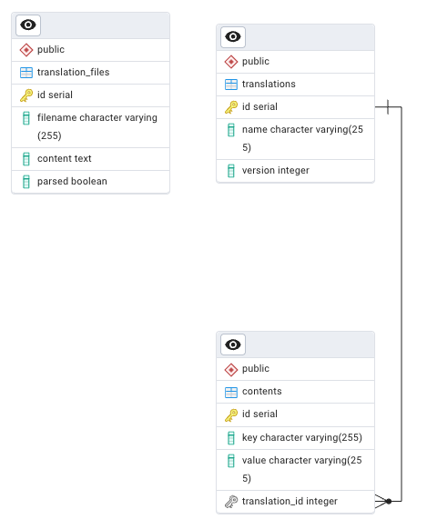

# Technical Choices Explanations

## Front-end and Back-end Architecture

### Back-end: NestJS
- **Modular architecture** with separation of concerns (controllers, services, modules)
- **Dependency Injection (DI)** for better testability and maintainability
- **Domain Driven Design (DDD)** to organize business logic
- Clear and scalable structure suitable for enterprise applications

### Front-end: Next.js
- **App Router** for modern and performant navigation
- **Static pages** to optimize performance and SEO
- **React Query** for efficient server-side state management (cache, synchronization, invalidation)

## Typing and Testing

### TypeScript
- Models defined in `models.ts` for translations and locales
- Strict typing to reduce runtime errors and improve developer experience

### Testing
- **Unit testing** for NestJS backend (business logic, services, controllers)
- **No e2e testing** with Playwright or Cypress due to time constraints
- Focus on coverage of critical backend functionalities

## Data Model

Refer to the ERD diagram below to understand the structure:

    

- A translation record corresponds to a **locale code** (e.g., fr-FR)
- Each content is a key-value pair for a translation: `{"test.test1.test2": "Hello World"}`
- Contents can be grouped by translation `code` and `key`, with display of missing values
- To get a complete list of keys and values: create subqueries for each translation name then join them all together

## Challenges Encountered

- **Finding the right model** for translation data manipulations
- **Data manipulation** to make the user interface intuitive and user-friendly
- Managing the complexity of relationships between locales, keys, and translation values

## What Would Be Implemented Differently

- **Rename models**: `translations` → `locales` and `contents` → `translations` for clearer semantics
- Review data architecture to simplify complex queries

## Suggested Features for Next Iteration

- **Add new locales** with empty values from the admin dashboard
- **Manage translations with projects** to organize different applications
- **User authentication & authorization** to secure access
- **Change history** and translation versioning
- **Public API** to integrate translations into other applications